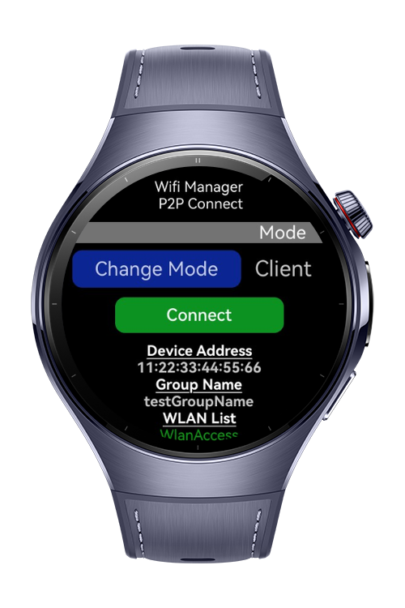
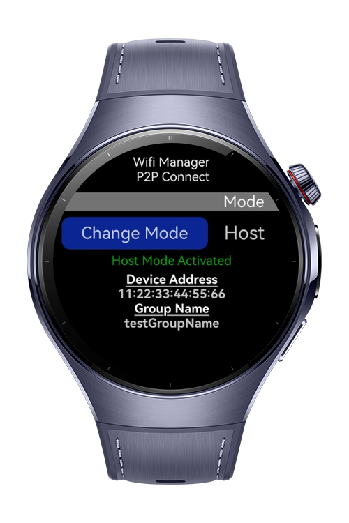
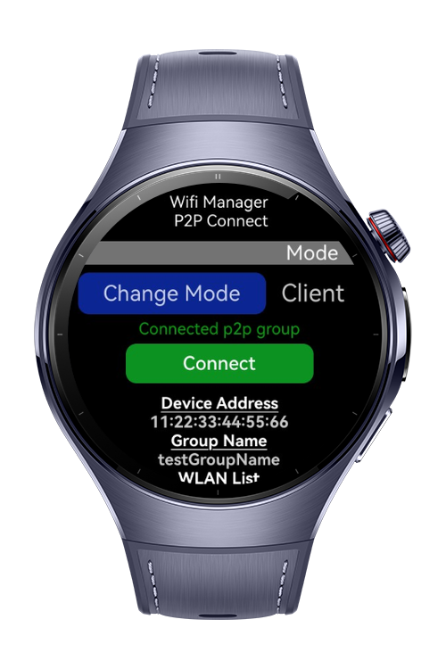

> **Note:** To access all shared projects, get information about environment setup, and view other guides, please visit [Explore-In-HMOS-Wearable Index](https://github.com/Explore-In-HMOS-Wearable/hmos-index).

# Wi-Fi P2P Manager

A simple application for managing Wi-Fi Direct (P2P) connections. This app allows users to create or join Wi-Fi P2P groups, toggle between Host and Client modes, and view available devices.

# Preview

<div>
  
  
  
</div>

# Use Cases

- **Create Wi-Fi P2P Group**: Host mode allows users to create a new Wi-Fi Direct group.
- **Join Wi-Fi P2P Group**: Client mode enables users to connect to an existing Wi-Fi Direct group.
- **Device List**: Displays available devices and groups.
- **Connection Status**: Provides feedback on group creation, connection, and disconnection.

# Technology

## Stack

- **Language**: ArkTS
- **Framework**: HarmonyOS NEXT
- **Tools**: DevEco Studio 5.1.0.849
- **Libraries**:
- **Libraries**:
  - `@kit.AbilityKit`
  - `@kit.ArkUI`
  - `@kit.ConnectivityKit`

## Required Permissions

- ohos.permission.GET_WIFI_INFO
- ohos.permission.INTERNET

## Diagrams - Process

```plaintext
First Device
User Interaction -> Mode Toggle -> Change Mode Host -> Display Status

First Device
User Interaction -> Mode Toggle -> Use Mode Client -> Connect -> Display Status
```

# Directory Structure

```
├── entry/src/main/ets/
│   │   ├───components
│   │   │       ClientMode.ets
│   │   │       DeviceInfo.ets
│   │   │       HostMode.ets
│   │   │
│   │   ├───constants
│   │   │       SizeConstants.ets
│   │   │
│   │   ├───entryability
│   │   │       EntryAbility.ets
│   │   │
│   │   ├───entrybackupability
│   │   │       EntryBackupAbility.ets
│   │   │
│   │   ├───models
│   │   │       SizeConstant.ets
│   │   │
│   │   └───pages
└── entry/src/main/resources
```


# Constraints and Restrictions

## Suported Devices

- Huawei Watch 5

# License

**Wi-Fi P2P Manager** is distributed under the terms of the MIT License
See the [LICENSE](./LICENSE) for more information.
